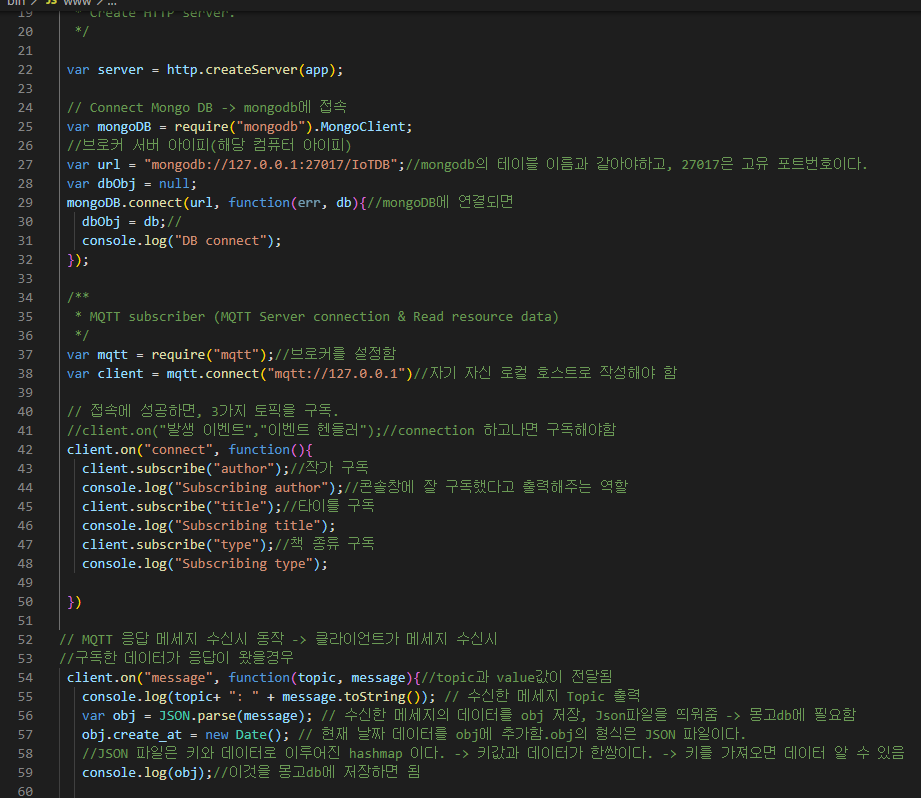
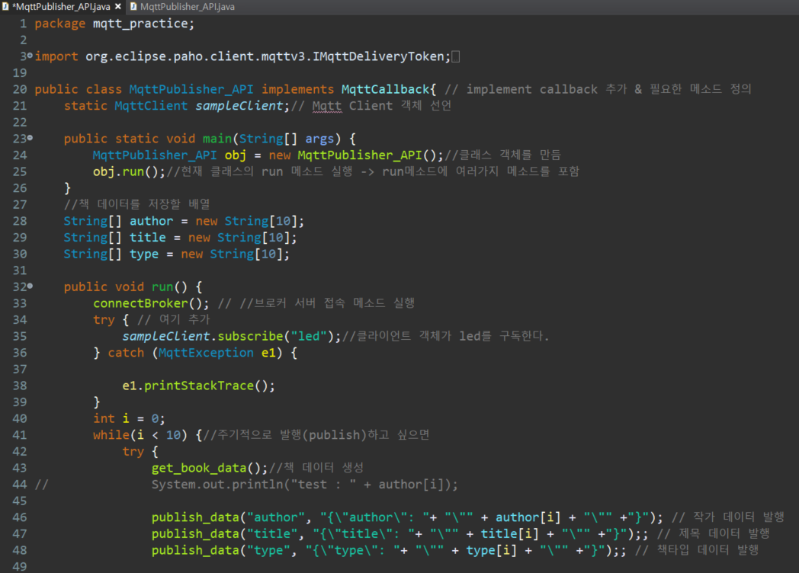

# MQTT 통신을 이용한 도서 추천 

---

### MQTT통신을 이용한 국립도서관 사서의 도서 추천 

- 개인 프로젝트 ( 안원영 )

---

## 프로젝트 정보

### 1. 프로젝트 주제  ( 사용 기술 및 내용 한줄 요약 )

- MQTT통신을 이용한 국립도서관 사서의 도서 추천 

### 2. 프로젝트 필요성 

- 현대인들은 많은 시간을 온라인상에서 보내고 있다. 온라인이 가지는 장점도 많지만 단점도 존재한다. 
  - 내가 생각하는 단점 중 가장 문제가 되는 부분을 생각해 보았다. 
  - 온라인에서 가장 쉽고 빠르게 접할 수 있는 컨텐츠는 유흥거리와 자극적인 정보라고 생각한다. 
  - 이런 컨텐츠들은 우리에게 재미를 가져다 주지만 쉽고 얕은 내용을 가지 고 있다. 
  - 따라서 사람들은 이런 컨텐츠에 많이 노출될수록 ‘생각’ 이라는 것을 점차 하 지 않게 된다. 
- 적은 시간동안이라면 괜찮겠지만 지금처럼 많은 시간을 온라인에서 보내 는 현대인들에게 있어서 생각할 시간이 없어진다는 것은 큰 문제가 될 것이다.
  - 따라서 이러한 문제를 해결하기 위해 이 프로젝트를 구성하였다.

### 3. 프로젝트 목적 (  어떤 기술을 사용해 어떤 내용을 구현할 것인지 )

- 프로젝트를 통해 앞서 설명한 문제가 심각함을 인지하고 개선해 보고자 한다. 
  - 프로젝트의 중점적인 목표는 사람이 생각할 시간을 많이 가지게 하기 위한 방법들중 하나를 소개하는 것이다.
  - 프로젝트에서 소개할 방법은 바로 ‘책’ 이다. 책은 좋은 정보와 함께 생각할 시간을 제공 한다. 
  - 또한 온라인보다 정확하고 신뢰할 수 있는 정보를 제공함으로써 개인의 성 장에 도움이 될 수 있을 것이다.
- 책을 추천하기 위해 사용할 API는 국립중앙도서관에서 재공하는 서사추천도서 이다.
  - 이 책은 크게 4가지의 종류로 나눠진다. 문학,인문과학,사회과학,자연과학으로 나눠서 책 을 추천한다. 
  - 이 프로젝트에서는 랜덤으로 4가지 종류중 하나를 선택해 2021.01.01 ~ 2021.05.31 까지의 추천도서 중 10가지의 정보를 추려 보여준다.

### 4. 프로젝트 기능구현  ( 어떤 기능들을 넣을 것인지 )

1. 현재날짜를 기준으로 URL과 JSOUP 패키지 이용해 실시간으로 추천 책정보 크롤링
2. MQTT 통신을 이용한 통신 broker와 publish, subscribe 구조 연습
3. MongoDB와 node.js 를 이용한 데이터 추출 및 저장 
4. Socket 통신을 통해 작가, 책제목, 책타입 Byte로 전송
5. socket 이벤트를 통해 랜덤의 배열 색상 전달 후 처리 
6. socket통신에서 사용되는 메소드와 동작과정 학습 

### 5. 프로젝트 개발환경 및 수행도구  ( 시스템 구조와 어떤 언어, 지식 , 툴, API 를 사용했는지 )

|     언어      |                웹                |                    개발도구                    |                       API & 통신                        |
| :-----------: | :------------------------------: | :--------------------------------------------: | :-----------------------------------------------------: |
| Java SQL | HTTP5 CSS  JQuery | Eclipse MongoDB Node.js ROBO 3T | Socket.io JSOUP JSON MQTT Mosquitto |

### 6. 시스템 구조 

- 시스템의 전반적인 동작 과정은 다음과 같다. 
- 먼저, Node.js의 MQTT subscriber가 MQTT Broker에게 타이틀, 작가, 종류 토픽의 구독을 요청하고
- 구독요청을 받은 MQTT Broker는 MQTT subscriber를 토픽의 구독자 리스트에 추가한다. 
- 그 다음, 타이틀, 작가, 종류 센서가 정보를 Publish하면, MQTT Broker는 해당 데이터를 MQTT Subscriber에게 전송한다. 
- 또한 버튼을 만들어 버튼색 변경기능을 추가했다. 

---

## 프로젝트 결과 

### 1. 데이터 구독 및 HTML 페이지로 데이터 전송 

- 이클립스와 MQTT로 통신해 DB에 데이터 저장 
- HTML 페이지와 socket 통신해 데이터 표시 
- mongoDB 의 ip와 port 번호로 연결한 객체를 생성 
- 브로커 설정해서 해당 client로 브로커와 connect 되면 3가지 토픽 구독 
- 이클립스의 publish_data() 함수에서 보낸 topic과 data 를 받아 message 이벤트 발생한다. 
  - massage이벤트는 3가지 키워드를 비교해 토픽에 맞게 DB에 **데이터 저장** 
- 연결된 socket.io 에서 HTML 페이지에서 socket_evt_update 이벤트 발생하면 socket 통해서 www.js 에 알림 
  - DB에 저장되어있는 책 정보들 가져옴 
  - socket_up_author 이벤트를 발생시킴 

### 2. 데이터 발행 

- www.js 파일과 broker를 통해 MQTT 통신  
- get_book_data() : URL 통해 JSOUP패키지 이용해서 책 데이터 doc 형태로 크롤링 
- run() : connectBroker() 함수 호출하고 get_book_data() 함수 실행시켜 publish_data() 함수로 데이터 보내기 
- connectBroker() : 브로커와 연결하기 위해 ip와 port 번호 설정 후 연결 
- publish_data() : topic과 data 받아서 client.publish()함수로 client에게 byte형태로 데이터 변형 후 전달 함 

### 3. HTML 페이지에서 socket.io 로 소켓 연결 

- Socket_up_author 과 같은 이벤트를 등록하여 해당 이벤트 발생시 socket 통신을 이용해 www.js로 알리고 DB의 데이터들을 JSON 의 형태로 담아 HTML 페이지로 전송 

###  4. 결과 

- 최종적으로 html 파일로 작가, 제목, 분류타입이 표시됩니다.
- 깔끔하게보기 위해 테이블을 사용 하였습니다.

---

### 결론

- Mqtt의  동작방식은  Client와  broker가  정보를  주고받는  형식으로  진행된다.  
- 여기서 client는 publisher가 될수도 있고 subscriber가 될 수도 있다. 
- 이 프로젝트에서 publisher 역할을  이클립스의  MQTTpubliser가  해주었고 정보를 보내 브로커인 Mosquitto 가 www.js 로 정보를 보내주면 www.js 에서 DB에 데이터를 저장해주고 socket에 가공된 데이터를 전달해 html 페이지에서 이 내용들을 받아볼 수 있게 되었다. 
- MQTT의 동작방식을 구체적으로 알 수 있게 되었고 배운 것을 토대로 센서와 연동시킬수만 있다면, 현재 우리가 쓰고있는 iot 기기들을 구현할 수 있을 것이다. 
- 아직은 많이 부족해서 실제센서와의 연결이 어떻게 되는지와 다양한 센서 연동 예시들을 통해 공부를 해 나가야 할 것같다.
