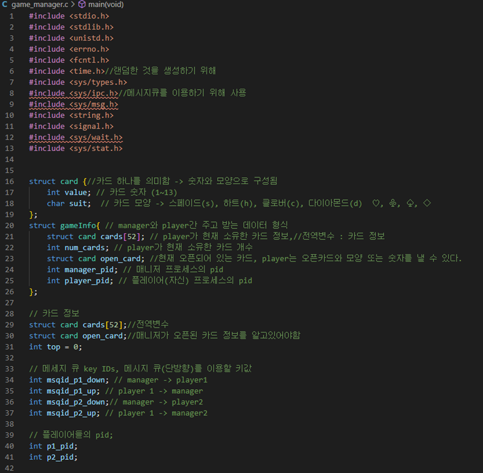

# Signal을 이용한 프로세스간 통신  

---

### Signal을 이용한 카드게임 

- 개인 프로젝트 ( 안원영 )

---

## 프로젝트 정보

### 1. 프로젝트 주제 

- 이번 프로젝트의 주제는 카드게임이다. 카드게임을 통해 게임 매니저가 플레이어와 상호작용하며 게임을 진행해 나간다. 
- 이 게임은 크게 3개의 프로세서로 구성되어 있다. 
  - Manager(카드 생성, 분배, 게임진행), 
  - player1(사용자 입력 받고 콘솔창에 표시), player2 이다. 
  - 각각의 프로세서 간 메시지 큐를 이용해 정보를 주고받으며 룰에 따라 게임에 승자와 패자, 무승부로 나뉜다. 

### 2. 프로젝트 필요성 

- 프로세스들의 동작방식을 학습하여 제어해보고 SIgnal 의 개념을 익힌다. 

### 3. 프로젝트 목적

- 이 프로젝트의 목표는 “프로세스가 어떻게 동작하는지 “, “프로세스간 데이터를 어떤 형식으로 주고받는지” 알아보는 것 이다. 

### 4. 프로젝트 기능구현  

1. 먼저 manager 프로세스를 실행시킨다. 
2. 실행시키면 13장씩 4종류의(스페이드, 하트, 클로버, 다이아몬드) 카드가 생성된다. 
3. 총 52장의 카드가 생성되면 랜덤으로 카드를 섞고 처음에 플레이어들에게 카드를 6장씩 분배한다. 
4. Card[top]의 정보를 주고받으며 모양과 숫자가 같은 카드를 가지고 있을 경우 card[top]을 낸 카드로 대체해 나간다.
5. 승패의 룰은 총 3개로, 먼저 가지고 있는 카드의 개수가 20개일경우 패배를 하며, 두번째로 카드를 다 냈을 경우 승리하게 된다. 
6. 그리고 52장의 카드가 다 떨어졌을 경우 카드 수를 따져서 승패를 결정한다. 

### 5. 프로젝트 개발환경 및 수행도구  

|        언어        |      사용 툴       |
| :----------------: | :----------------: |
| 리눅스  C언어 | VSCode 우분투 |

### 6. 시스템 구조 

- 본 시스템은 생성자 프로세스와 소비자 프로세스로 구성된다. 
  - 생성자 프로세스는 가상의 자원을 생성하는 역할을 수행한다. 
  - 소비자 프로세스는 생성자가 만든 자원을 소비하는 역할을 수행한다. 
  - 두 프로세스간 동기화는 Fork와 INT Signal을 통해 수행된다. 구체적으로, 생성자 프로세스가 먼저 실행되고, Fork를 통해 소비자 프로세스를 생성한다. 
- 그리고, 소비자 프로세스는 처음 6장의 카드를 받은 후 SIGUSR1 이라는 signal을 pause()를 사용해 기다린다. 
  - 생성자 프로세스로부터 signal이 오면 메시지 큐를 이용해서 정보를 주고 받는다. 
  - 메시지 큐는 FIFO(먼저 들어간 것이 먼저 나오는 구조)로 단방향으로 진행된다. 
  - 또한 커널이 전역에서 관리되어서 모든 프로세스가 접근할 수 있다는 장점을 가진다. 
- 메시지 큐는 총 4개의 메소드로 나뉜다. 
  1. msgget(메시지 큐 생성)
  2. 2.msgsnd(메시지 큐 전송)
  3. 3.msgrcv(메시지 큐 수신)
  4. 4.msgctl(메시지 큐 컨트롤) 
  5. Msgget을 통해 큐를 생성하고, msgsnd를 이용해 메시지 큐ID를 통해 데이터를 전송한다. 전송한 곳에서는 msgrcv로 메시지 큐를 받게되고 그 안의 데이터를 꺼내 이용한다. 
- 진행 순서 
  1. 생성자 프로세스가 소비자 프로세스에게 top인덱스의 카드정보(오픈카드정보)를 주면 소비자 프로세스는 자신이 받은 카드 중 모양과 숫자를 비교한 후 같은 숫자가 있으면 해당 플레이어의 정보에있는 open_card를 수정한 후 생성자 프로세스에게 보낸다. 
  2. 생성자 프로세스는 받은 카드정보를 보고 자신이 소비자 프로세스에게 준 카드와 비교하여 같은 카드라면 카드 한 장을 더 추가해서 소비자 프로세스에게 보내준다. 
  3. 생성자 프로세스가 받은 카드가 다르다면 그 카드를 open_card로 설정하고 다음 소비자 프로세스에게 open_card 정보를 넘겨준다

---

## 프로젝트 결과 

### 1.  카드구조   ( 생성자 프로세스 )

- 먼저 game_manager의 시작부분이다.
  - card구조체와 gameInfo 구조체를 이용해 카드게임에 필요한 카드 형태를 만들어준다. 
  - 또한 데이터를 주고받기 위해서 메시지 큐를 사용하는데, 어떻게 메시지 큐를 사용할 것인가를 미리 변수로 만들어 놓는다. 
  - 그리고 해당 프로세스와 데이터를 주고받기 위해 해당 프로세스의 ID가 들어갈 변수를 선언한다

### 2. 카드 구조 및 게임 룰 정의 ( 생성자 프로세스 )

- 카드 게임 중 사용할 메소드들이 모여 있는 곳이다. 

  - 여기서는 카드를 생성한 후 섞는 것을 볼 수 있다. 카드의 모양은 총 4가지로 구성되어 있으며, 한 종류당 13장의 카드를 가진다. 

  1. Fork()를 이용해서 자식프로세스를 만들고 메소드를 호출하였다. childProcess 메소드는 부모 프로세스가 끝난 후 실행되는 메소드로, 현재 오픈 된 카드의 정보를 넘겨받아 카드의 value와 suit를 출력한다. 
  2. 그 다음 메소드는 turn_count 메소드이다. 이 메소드는 4턴이 지날 때 마다 printf해서 4턴이 지났다고 알려준다. 
  3. 마지막으로 stop_game은 중간에 게임 일시정지 같은 기능으로 추가해봤다. 여기서는 mkfifo를 이용해 파일을 생성한 후 파일로 데이터를 전달받고 출력해봤다. 
     - Mkfifo는 fifo파일을 만드는 메소드로,. Fifo는 파이프의 한 종류로, 프로세스 통신을 위해 사용되며 부모와 자식 사이에서만 사용할 수 있는 PIPE와는 다르게 fifo파일에 접근할 수 있는 모든 프로세스가 통신할 수 있는 기능을 말한다. 
     - fifo파일은 동기화로 인해 쓰기 또는 읽기를 하려면 다른 프로세스가 해당 파일을 읽거나 쓸 수 있도록 open을 해야 한다.
     - 즉, 하나라도 열려 있지 않으면 동기화로 인해 그 다음 문장이 실행되지 않고 계속 기다린다. 
     - 나는 여기서 일정 턴이 지나면 이 메소드가 호출되면서 동기화로 인해 stopgame.c 파일을 하나 만들어 이 fifo 파일을 열때까지 기다리도록 구성하였다. 
     - fifo파일을 열게 되면 다시 게임이 진행된다.

### 3.  카드게임 시작1 (카드생성 및 프로세스 생성 ) 

- 프로세스 ID와 메시지 큐 ID 생성 
  - 먼저 카드를 만들고 섞는다. 메시지 큐 ID를 통해 송수신 역할을 할 수 있도록 만든다. 또한 주고받을 gameInfo 데이터를 생성하고 구조체의 값들로 데이터를 주고 받는다. 

- 초기에 플레이어들에게 카드를 6장 생성하여 전송하고, 전송한 12장 만큼의 카드를 빼는 의미로 전체 52장의 배열 카드에서 인덱스 12를 증가시켜 배열에서 없앤다. 
  - 그리고 뺀 12장다음오는 카드의 정보를 open_card 정보로 설정한다. 
  - 여기서 top 변수는 open_card의 인덱스를 나타낸다. 

###  4.  카드게임 시작2 ( 게임 시작  ) 

- 전달할 큐를 만들었으면, manager가 카드관리를 하기 위해 recive라는 수신을 받기 위한 gameInfo도 만든다. 
  - 여기서 signal(SIGALRM, turn_count)를 이용해 alarm(3) 이 발생했을 때 3초뒤 turn_count 함수가 호출되도록 만들었다. 
  - Signal(SIGTTOU,stop_game) 은 앞에서 말했던 것 처럼 일정 턴이 지나면 강제적으로 쉬게 만들기위해 사용하였다.
  - raise를 이용해 현재 프로세스에 signal을 발생시킨다. 
  - SIGTTOU라는 signal이 발생하면 stop_game() 메소드가 실행되도록 하였다. 하지만 signal신호가 잘못됐는지 정상작동이 되지 않아 실패하고 말았다. 

- While 반복문에 들어가면 여기부터 본격적인 게임이 시작된다. 
  - Kill()메소드는 해당 pid로 signal 신호를 보내주는 역할을 한다. 
  - 여기서는 플레이어1에게 SIGUSR1 이라는 signal을 주는데, 이때 플레이어1은 아까 앞에서 카드 6장을 받고 pause()로 대기중이던 상태를 벗어나 동작하게 된다. 
  - Fork()는 현재 프로세스와 같은 자식 프로세스를 만든 후 open_card 정보를 콘솔에 출력하도록 구성했다. 
  - Pid가 0인 것이 자식 프로세스이다. 그리고 밑에는 파이프를 사용하기 위해 fd와 배열을 만들어 주었다. 

- Fork로 생성된 Pid 가 0이 아닌 경우는 부모 프로세스이다. 
  - 따라서 부모프로세스가 먼저 실행이되고 자식 프로세스가 실행이 된다. 
  - 여기서 부모 프로세스와 자식 프로세스의 끝나는 순간을 맞추기 위해 wait를 사용하였다. 
  - Wait를 쓰지 않게 되면 자식 프로세스가 종료되었는데도 어떠한 오류로 커널에 0을 전달하지 못해 부모는 종료를 모르지만 자식프로세스는 메모리를 반납하게 된다. 
  - 이때 이 메모리를 다른 프로세스가 사용할 수 있는 위험이 생기게 된다. 
  - 따라서 종료된 지 모르는 고아 프로세스(좀비 프로세스)가 만들어지는데, 이것을 부모프로세스가 직접 죽여줘야 한다는 불편함이 생기게 된다. 
  - 자식 프로세스가 끝날 때 까지 기다리는 wait를 사용해 부모가 자식프로세스의 종료를 기다리도록 하였다. 
- if문과 else문을 이용하여 execl과 pipe, popen을 구현해 보려고 하였으나 실패했다.
  - execl은 fock()와 비슷한 방법으로 프로세스를 만들어 실행하는 메소드이다. 
  - 하지만 이것을 사용하게 되면 부모프로세스가 종료되기 때문에 시용하지 않았다. 
- Pipe는 write와 read를 이용해 프로세스간 데이터를 주고받는 역할을 한다. 
  - Fd는 0과 1이 있는데, 0은 read 즉, 데이터를 읽어올 때 사용하고, 1은 write 즉, 데이터를 쓰고자 할 때 사용한다. 
  - 파이프를 통해 앞에서 구현했던 일정 turn마다 몇turn인지 알려주는 것을 만들어보려고 했지만 잘 되지 않았다. 
  - Popen은 pipe를 개선한 것으로 pipe는 단방향이라면, popen은 양방향으로 read와 write를 할 수 있는 방법이다.

### 5. 카드게임 시작3(  메시지 큐 이용 데이터 전달 ) 

- 이 부분은 데이터를 플레이어에게 전달하는 구간으로, 메시지 큐를 본격적으로 이용한다. 
- Send_p1에는 플레이어1의 gameInfo가 저장되어 있어서 msgsnd로 메시지 큐를 전달하게 되면 수신이 올때까지 기다리게 된다. 
  - 플레이어1으로부터 메시지가 오면 msgrcv에 의해 메시지가 수신되며 receive_p1에 카드 정보가 저장된다. 
  - 여기서 reveive_p1는 플레이어의 카드로, 플레이어 1이 낸 open_card의 정보가 들어있다. 
- open_card 정보를 이용해 카드를 맞춘다. 
  - manager가 준 open_card 정보와 같다면 내지 못한 것 이기 때문에 52장의 카드 중 1장을 더해 플레이어에게 보낸다.
  - 같지 않다면 잘 낸 것 이기 때문에 open_card정보를 receive의 open_card 정보로 바꿔서 다음 플레이어에게 전달한다. 

### 6. 카드게임 시작4 (  승패 조건 )

- 이 부분은 승패에 연관된 부분이다. 플레이어 카드의 개수가 0이 되거나 상대 플레이어 카드의 개수가 20개가 넘어가면 해당 플레이어가 이기게 된다. 
- 여기서 무승부 부분을 바꿔주었다. 
  - 52장의 카드를 다 썼을 경우 받은 receive_p1의 카드숫자를 다음 플레이어의 카드숫자와 비교하여 승패를 나누게 된다. 
  - 개수가 같으면 무승부가 나겠지만, 카드의 개수에 따라 승부가 난다. 

### Player1 

- 초기정보를 메시지 큐로 msgrcv(수신) 하여 현재 플레이어의 gameInfo에 저장한다. 
- 저장한 후 나의 pid와 gameInfo 정보를 manager에게 보낸다. 
- Game이 시작되고, signal들을 나열한다. 이 signal들은 매개변수로 있는 시그널이 왔을 때 매개변수의 함수를 호출하게 된다.  

### Player1 ( signal 기다리고 카드 정보보고 인덱스 입력  )

- Pause()를 이용해 signal이 올때까지 기다리고 SIGUSR1이 오면 그 다음을 수행한다. 
  - 데이터를 전달받고 자기가 가지고 있는 카드 정보를 출력해서 보여준다. 
- 사용자가 인덱스를 입력하면 해당 인덱스 카드 내용과 비교하여 모양이나 숫자가 같으면 open_card 정보를 수정한다. 
  - 다르다면 그냥 카드정보를 보낸다. 그렇게되면 manager에서 판별해서 카드 1장을 추가시켜서 재전송 해준다. 
  - 재전송한 메시지 큐를 받아 자신의 정보에 추가한다. 

### Stop Game

- 이 코드는 stop_game() 메소드가 실행됐을 때 실행하는 프로세스이다. 
  - Mkfifo로 동기화 되어있기 때문에 읽기나 쓰기 둘 중 하나가 open을 하지 않는다면 다음으로 넘어가지 않고 계속 대기하게 된다. 
  - 따라서 중간에 일정 턴이 오면 게임을 멈추고 이 파일이 실행될 때 까지 기다린다

### 실행화면

- 먼저 세가지 파일을 컴파일 진행해준다. 
- Gcc 로 해줘도 되지만 ctrl + shift + b로도가능하다. 
  - Manager -> player1 -> player2 순으로 구동 시켜준다. 
  - 그러면 처음에 초기 카드를 제공하게 되고 카드를 플레이어가 다 받으면 manager가 player1 부터 kill을 통해 턴을 알린다. 
- 순서대로 카드의 인덱스를 입력 하다 보면 작성된 승패 룰에 따라 승패가 나뉘게 된다. 

---

### 결론

- 이번 프로젝트의 목적은 “프로세스가 어떻게 동작하는지 “, “프로세스간 데이터를 어떤 형식으로 주고받는지” 이다. 
  - 서로 데이터를 어떻게 주고받았으며, 그 데이터를 가지고 어떤 방식으로 다시 전송하는지에 대한 내용을 다뤘다. 
  - 데이터 전송 순서와 특징들을 살펴보았으며 전달에도 많은 메소드의 종류가 있다는 것을 알게 되었다. 
    - 또한 signal을 통해 사용자가 signal을 줄 수도 있지만 프로세스 안에서 프로그래밍으로도 signal을 주어 다양한 동작을 만들어 낼 수 있다는 것을 알게 되었다. 
  - Pipe와 popen같은 메소드를 이용해서 구동이 되지는 않았지만 이런 메소드들을 이용한다면 파일 입출력으로 더 손쉽게 파일의 내용을 읽고 쓸 수 있을 것 같다. 
    - 앞으로 공부를 할 때 많은 예시들을 찾아보며 이해를 하는 것이 좋을 것 같다

---

## 참고자료

*1.*  *프로젝트 구현을 위해 참고한 모든 자료를 기술한다. 아래는 예시.*

*2.*  [*https://www.joinc.co.kr/w/Site/system_programing/Book_LSP/ch08_IPC*](https://www.joinc.co.kr/w/Site/system_programing/Book_LSP/ch08_IPC)*,* *생성자-소비자 IPC 프로그래밍 예제.*

*3.*  [*https://github.com/nathankim0/Blackjack-NamedPipe*](https://github.com/nathankim0/Blackjack-NamedPipe)*, IPC**를 활용한 블랙잭(카드) 게임 예제.*